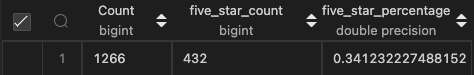
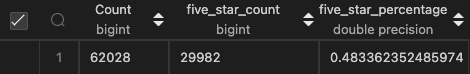
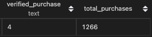
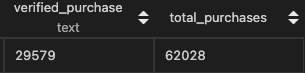

# Amazon Vine Analysis

## Overview

The purpose of this analysis is to review the review data provided by _Amazon_ and determine if there is any bias towards favorable reviews by members of the paid **Amazon Vine Program**. The Vine Program members receive products in return of a review, which is why this analysis must be done.

## Results

The analysis made us answer the following questions, which would be crucial for determining the task in hand:

- _How many Vine reviews and non-Vine reviews were there?_
- _How many Vine reviews were 5 stars? How many non-Vine reviews were 5 stars?_
- _What percentage of Vine reviews were 5 stars? What percentage of non-Vine reviews were 5 stars?_

The following two images were obtained doing SQL queries and will be used to answer the aforementioned questions:

**Vine Reviews Statistics**  
  
**Non-Vine Reviews Statistics**  

- For every vine review, there are almost **49** non-vine reviews. Having this in mind, the much smaller size of the former might me prone to skewed results. There were **62,028** non-vine reviews while only **1,266** vine ones.
- There were **29,982** non-vine five-star reviews while only **432** for vine ones This indicates a **69:1** ratio.
- As for the proportion of five-start reviews to total reviews, it is favorable for the non-vine reviews by a wide margin. In this group, **48.3%** of the reviews were five-stars while only **34.1%** in the other group.

## Summary

It was originally expected that the Amazon Vine members would give better reviews since they were not actually paying for the product. However, we can see that this is not the case since the proportion of five-star reviews was much higher for non-vine members. First of all, it is important that given such a small sample size, the results cannot be considered as conclusive and a bigger sample should be tested.   As for the results, I would expect that since the reviewers are receiving the product for reviewing purposes, they are being stricter in how they review a product. Amazon Vine is invitation only for the most prolific reviewers, which might explain why the stars are not as high as originally expected. 
Another analysis I would perform is one regarding verified purchases to assess the veracity of the reviews.

From the following image, we can see that from the total non-vine reviews, only **29,579** were verified purchases. That is a great contrast with the vine-program reviews, where only **4** purchases were verified.

**Vine Verified**  
  
**Non-Vine Verified**  
  

After doing this, it supports the hypothesis that vine reviews might be lower since the people receiving the products did not actually ordered them and could not have been interested or did not have a use for them. On the other hand, almost have of the non-vine reviews were purchase-verified, meaning that the people leaving those reviews actually wanted the product; thus leaning into higher reviews.
